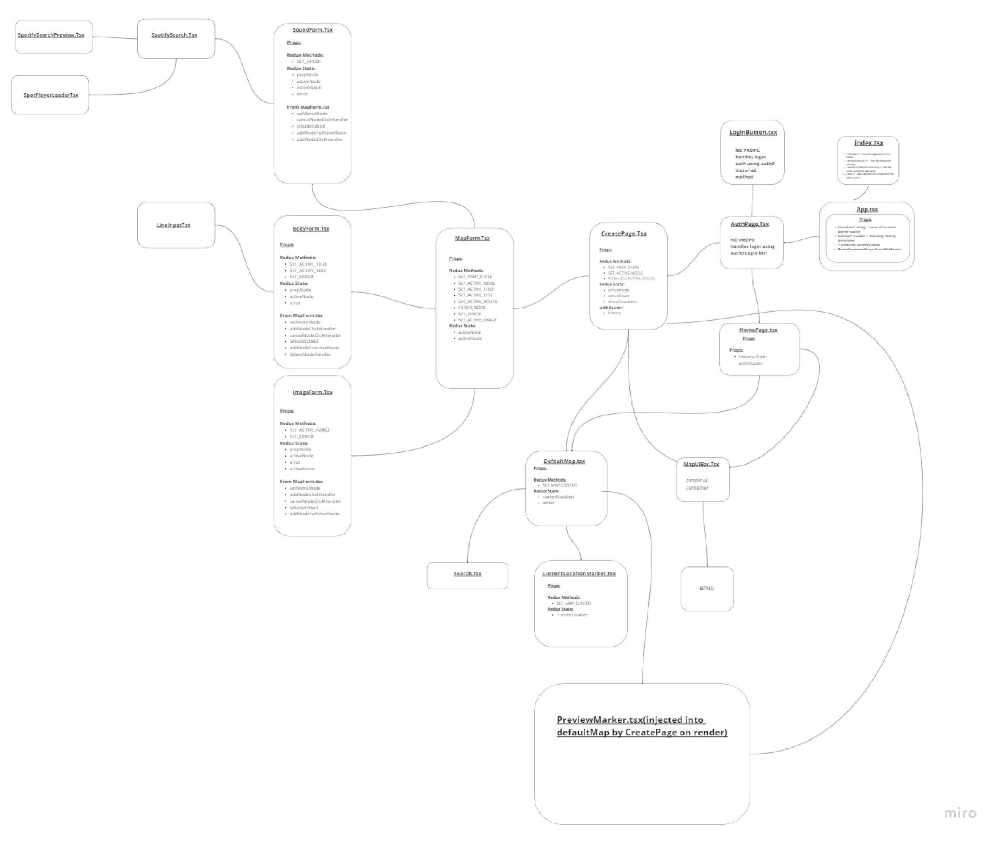

# Scavenger Frontend(WIP)

## Demo

https://scavenger-frontend.vercel.app/
Note: demo may be buggy at times as app is in development.

## Video Overview

[Video Demo](https://kainan.io/static/media/scav-vid2.1e46ed74.mp4)

## Brief Summary:

-   Project is mobile friendly/preferred web app.
-   Goal of the project is to enable users to share/save/like collections of nodes(routes) that can have multiple types of data stored(images, podcasts, songs, playlists, title, and text). The routes can be created/shared/viewed using google maps api with the web geolocation api.

## In Depth Component Docs(experimental)

https://kainan54.github.io/scavenger_frontend/

## Component Diagram/Flow Chart

## Progress:

-   Spotify Auth0/Login Frontend + Backend ✓
-   FrontEnd Login Page ✓
-   FrontEnd Home Page ✓ (Now does geoSpatial query for routes based on map center, can preview routes and navigate to user pages from preview)
-   Front End Create Page ✓
-   Front End Profile Page ✓ ...actually like 95% also want to user show likes here(when likes are added). Should be able to use same render component with diff array/map fn probably and toggle btn somewhere
-   Backend Image uploads via s3 bucket ✓
-   Backend Geo Spatial queries ✓ (mentioned but its really a backend feature, plus I like ✓ marks!)

-   Front End Route dedicated Show page ✘ (right now routes can only be viewed on home-page-mini preview and user profile pages)
-   Frontend + backEnd User Likes ✘

## backend init(3/16/21)

-   https://github.com/kainan54/scav-backend
